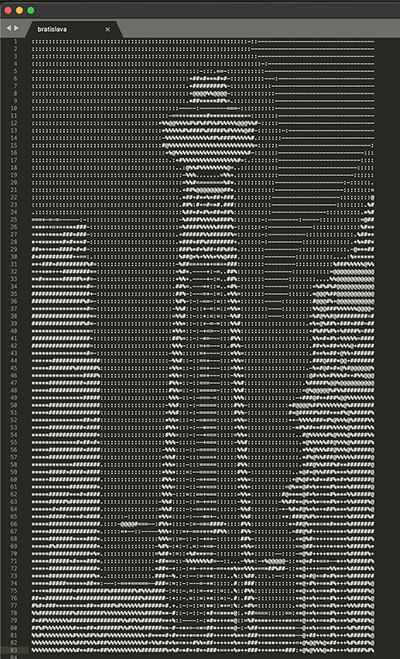

# scala-image-transformer

This application is a sbt command-line tool that converts images, generates images, and applies filters. **It focuses on clean object-oriented design, modularity, high cohesion, low coupling, and easy expandability.** It includes comprehensive tests, which are also designed with the mentioned OOP principles in mind.

Currently, the app supports *jpg*, *png*, and *bmp* formats as input or it generates an image at random. It converts the images from the input into ASCII art, using either the default linear/non-linear transformations or a custom transformation table provided by the user. Additionally, users can apply a sequence of filters such as rotation, scaling, and inversion. The final output can be printed, saved to a file, or both.

The application's extendability, however, allows for the addition of new input/output formats, transformations, filters, and output methods with minimal effort. If you're interested, feel free to contribute and expand its functionality!

## Running the app

Simply build the app with `sbt`, then run it using `run` and arguments. A full list of available arguments is provided in the section below.

**Example of Running the App:**

Let's say we want to take the image *ufo-bridge.jpg* from the */sample_input* directory, convert it into ASCII art, apply a -90 degree rotation, scale it down to 1/4 of the original size, and invert the colors to make the bridge more visible. Finally, we want to save the result to a file called *bratislava_asciiart.txt*. To do this, we will run the following command within the sbt shell:

    run --image "sample_input/ufo-bridge.jpg" --rotate -90 --scale 0.25 --invert --output-file "bratislava_asciiart.txt"

This will take the *ufo-bridge.jpg* image (intentionally rotated):

and save the following result to the specified _txt_ file:

Note that the stretched aspect ratio is caused by the font and formatting of the output. While proper scaling could be implemented as an additional filter in the future, it is not currently supported.

**List of all allowed arguments for 'run' in sbt:**
  
* `--image PATH`
  : _Specify the path to the image file._

* `--image-random`
  : _Generate a random image as the source._

* `--rotate NUMBER`
  : _Apply rotation by the specified degrees._

* `--scale NUMBER`
  : _Apply scaling by the specified factor._

* `--invert`
  : _Apply an inversion filter to the image._

* `--output-console`
  : _Export the output to the console. (Default, if no output arg passed.)_

* `--output-file PATH`
  : _Export the output to a file at the given path._

* `--table TABLE_NAME`
  : _Specify a grayscale-to-ASCII conversion table._

* `--custom-table CHARACTERS`
  : _Specify a custom grayscale-to-ASCII table using characters._

Allowed TABLE_NAME values are: `linear` and `non-linear`.

**Testing the app:**

To run the test suite, navigate to the root project directory and execute `sbt test`.

When expanding the app, please make sure that you run the existing tests and add new ones for any new functionality. Also, make sure the tests, and of course the main code, follow object-oriented principles.
